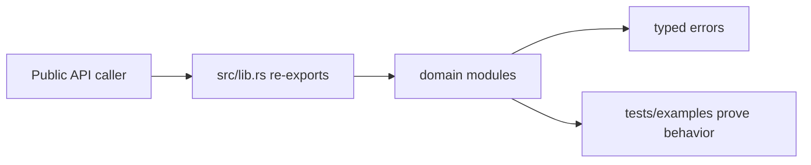

# Rust Library Architecture Documentation

Create architecture documentation for existing Rust code from source evidence. The deliverable should help future engineers and agents understand how the library works today, where the important boundaries are, and how to change it safely.

This is not a greenfield design skill. Do not invent a target architecture, copy generic Rust project templates, or describe recommended redesigns as current behavior.

## Core Standard

Architecture docs for an existing Rust library must be:

- Source-backed: every structural claim traces to source, tests, examples, generated API docs, or build configuration.
- Current-state first: separate "how it works now" from "recommended changes".
- Reader-oriented: explain where to start, which modules matter, and which invariants must not be broken.
- Rust-specific: document ownership, borrowing, error propagation, feature flags, async/concurrency, serde/FFI/binding contracts, and public API shape when they apply.
- Concise: document the architecture, not every function.

## Workflow

Track the documentation work with this checklist:

```markdown
Rust Library Architecture Docs:
- [ ] Identify target library/workspace and intended reader
- [ ] Inventory crates, modules, features, binaries, examples, tests, benches, and generated bindings
- [ ] Map public APIs, re-exports, traits, constructors, error types, serde contracts, and extension points
- [ ] Trace core data/control flows from source and tests
- [ ] Document ownership, error, async/concurrency, and persistence/serialization boundaries
- [ ] Validate diagrams, examples, commands, and code references against source
- [ ] Record an evidence log mapping architecture claims to source files, tests, manifests, bindings, generated docs, or commands
- [ ] Separate current architecture from recommendations or known gaps
- [ ] Add an explicit unverified/omitted section for anything not checked
- [ ] Add handoff guidance: where to start, what not to change casually, and verification commands
- [ ] Run the smallest relevant docs/format/tests checks or state what was not run
```

### 1. Set Documentation Scope

Before writing, determine:

- Audience: maintainers, contributors, API users, binding authors, future agents, or reviewers.
- Scope: one crate, one subsystem, all workspace members, public API only, or internal architecture.
- Stability: shipped public API, branch-local work, persisted formats, or generated bindings.
- Output location: follow the repo's existing docs layout. If none exists, prefer `docs/architecture/`.

If the user asks for "architecture docs" broadly, propose a small source-backed doc pack instead of a huge generated manual.

### 2. Build A Source Map

Use source evidence before writing prose:

- `Cargo.toml` and workspace manifests for crate topology, features, bins, examples, benches, dependencies, and optional integrations.
- `src/lib.rs`, `mod.rs`, and re-export modules for public shape.
- Public structs, enums, traits, constructors, builders, error types, and serde attributes for API contracts.
- Tests, examples, benches, and doctests for intended workflows.
- Bindings or FFI layers for cross-language contracts.
- Generated docs output when the repo publishes or derives API documentation.
- README and existing docs only as intent/context after source confirms current behavior.

Do not infer behavior from names alone. If a module name suggests one thing but source shows another, document the source truth and call out the mismatch if it matters.

### 3. Choose The Right Doc Pack

Prefer the smallest set that makes the architecture understandable:

| Scope | Recommended files |
| --- | --- |
| Single crate | `docs/architecture/<crate>.md` |
| One subsystem | `docs/architecture/<subsystem>.md` plus a short index entry |
| Multi-crate workspace | `docs/architecture/README.md` and one focused file per major crate group |
| Public API handoff | `docs/architecture/<crate>-api-boundaries.md` |
| Agent handoff | `docs/architecture/<crate>-handoff.md` |

Only create many files when the library genuinely has independent architecture areas. Empty directories and generic ADR sets are for greenfield planning, not source-backed documentation.

## Content Template

Use this structure for each architecture document:

```markdown
# <Library Or Subsystem> Architecture

## Purpose
What this library/subsystem does, who uses it, and what it deliberately does not do.

## Source Map
- Crates/modules:
- Feature flags:
- Public entry points:
- Tests/examples checked:

## Architecture Overview
Short explanation of the main components and dependency direction.

## Core Data Flow
How data enters, is validated, changes ownership, crosses boundaries, and exits.

## Public API Boundaries
Stable types, traits, builders, error types, serde fields, re-exports, and compatibility-sensitive names.

## Evidence Log
Map each major claim to the files, symbols, tests, examples, manifests, generated docs, bindings, or commands that prove it.

## Ownership And State
Where values are owned, borrowed, cloned, cached, or shared. Call out expensive clones and shared mutable state.

## Errors And Panics
Error types, conversion boundaries, context policy, and allowed panic locations.

## Async And Concurrency
Runtime assumptions, spawned tasks, blocking work, shared state, cancellation, and backpressure. Omit if not applicable.

## Persistence, Serialization, And Bindings
Serde contracts, database/schema implications, FFI/PyO3/WASM bindings, generated files, and compatibility rules. Omit if not applicable.

## Extension Points
Traits, registries, feature-gated modules, plugin points, or intended customization surfaces.

## What Not To Change Casually
Invariants, compatibility edges, numerical assumptions, ordering guarantees, public names, and behavior covered by tests.

## Verification
Commands or targeted tests that validate this area.

## Unverified Or Omitted
Crates, features, APIs, diagrams, examples, commands, generated docs, or claims not checked, with the reason.

## Known Gaps Or Recommendations
Clearly labeled issues or improvements. Do not mix these into current-state architecture.
```

## Diagram Rules

Diagrams must reflect verified source:

- Use simple ASCII or Mermaid only when it clarifies dependency direction or data flow.
- Label crate/module names exactly as they exist.
- Do not draw layers, queues, caches, or services that are not present.
- If a diagram is simplified, say what it omits.

Example:



## Verification

Run the smallest relevant checks for the documentation surface:

- Markdown or docs formatter if the repo has one.
- `cargo test --doc` when examples or rustdoc snippets were added.
- Targeted crate tests when documenting behavior from tests.
- Binding or generated-doc checks when documenting PyO3/WASM/FFI surfaces.

If checks are too expensive, still verify symbol names and paths by source inspection and state what was not run.

Remove any diagram, example, command, or code reference that cannot be tied to source or validation status. Do not leave inferred architecture in the document just because it reads well.

## Red Flags

Stop and re-check source when you catch yourself writing:

- "This likely..."
- "The module appears to..."
- "The architecture should..."
- "Future agents should implement..."
- "This follows a clean architecture pattern..." without source proof.
- A diagram edge you have not traced in code.
- A command or example you have not validated.

## Output Style

When reporting back:

- State which architecture docs were created or updated.
- List the source files, tests, examples, manifests, and bindings checked.
- Mention validation commands and results.
- Call out any areas that remain inferred, unchecked, or intentionally omitted.

The docs are the deliverable. Keep the summary short.
