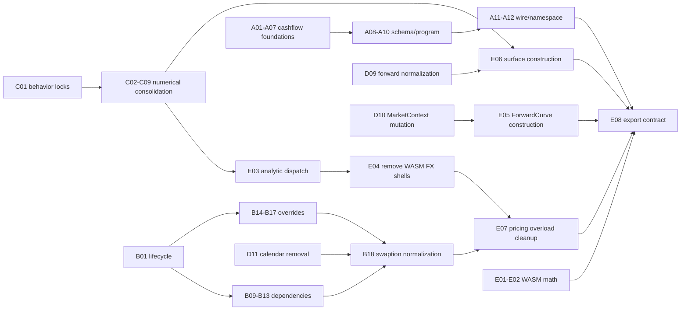

# Simplicity Remediation PR Plan Index

**Based on:** [2026-07-12 core, cashflows, and valuations simplicity audit](../2026-07-12-core-cashflows-valuations-simplicity-audit.md)
**Snapshot:** `1868f5b6b`
**Plan date:** 2026-07-12
**Total standalone PR plans:** 61

These plans close all 33 audit findings and all 12 incidental hazards. Each file is a self-contained handoff for one implementation branch. The normal target is 1–5 files and fewer than 300 net changed lines. Plans marked as compile-atomic or domain-wave exceptions are intentionally larger because splitting them would leave a non-compiling or half-migrated public type.

## How to use a plan in another agent run

1. Start from a clean branch based on every dependency named in the plan.
2. Give the agent exactly one plan file and instruct it to implement only that slice.
3. Re-read every listed source file before editing; the audit snapshot may have drifted.
4. Run focused tests while iterating, then every merge gate listed in the plan.
5. Record actual final status lines. A claimed green result without output is not accepted.
6. Run the targeted `finstack-simplify` re-audit. Merge only when its acceptance clause is satisfied.
7. Rebase before merge. PRs may be implemented in parallel, but shared manifests and hot files merge serially.
8. Tier-4 plans require explicit user sign-off before implementation and again before merge when the PR selects a financial, serde, calendar, or parity convention.

Suggested handoff prompt:

> Implement exactly the slice in `<plan-file>`. Respect its dependencies, non-goals, invariants, and file boundary. Stop if the checkout has drifted enough to invalidate the plan. Verify every listed gate and return the actual results plus the targeted simplicity re-audit.

## Cluster ownership

| Cluster | Plans | Owns |
|---|---:|---|
| A — Atomic cashflow state | 12 | F3, F4, F12–F16, F24, F27; H2, H3, H4, H6, H8, H10 |
| B — Valuations runtime contract | 18 | F1, F9, F11, F17, F19, F25, F30, F31; H1 |
| C — Canonical numerical ownership | 9 | F2, F5, F18, F20; H5, H7, H12 |
| D — Core public-surface reduction | 14 | F6, F8, F10, F21–F23, F29, F32, F33; H9, H11 |
| E — Binding boundary cleanup | 8 | F7, F26, F28 and binding portions of F15, F20, F27, F33 |

Overlapping audit clusters have one implementation owner. A owns the cashflow binding/schema changes, C owns FX-delta construction, and E consumes those results rather than duplicating them.

## Dependency map



## Recommended execution waves

| Wave | Safe parallel work | Merge constraints |
|---|---|---|
| 0 — behavior locks and narrow deletions | C01; A01, A02, A06; B01–B04, B06; D01–D04, D07, D08 | Merge C01 first in Cluster C. Keep shared-file PRs serial. |
| 1 — canonical foundations | A03; B05–B09, B14; C02, C03, C06, C08; D09 | B01 must precede B09/B14. C01 must precede every C plan. |
| 2 — vertical migrations | A04–A09; B10–B12, B15–B16; C04, C05, C07, C09; D05, D06, D10 | Rebase each domain wave. Do not merge competing edits to common manifests together. |
| 3 — removal and wire cleanup | A10–A12; B13, B17, B18; D11–D14; E03–E07 | Tier-4 and compile-atomic PRs merge one at a time with full gates. |
| 4 — final binding consolidation | E01, E02 if not already landed; E08 last | E08 must see the final post-A12 and post-E07 surface. |

## Hot-file serialization rules

- `finstack-quant-py/parity_contract.toml`: every PR touching it may be implemented in parallel, but must rebase and merge serially.
- `finstack-quant/cashflows/src/builder/schedule.rs`: follow A03 → A04 → A05.
- `finstack-quant/valuations/src/instruments/common_impl/traits/instrument.rs`: follow B01 → B09/B14 → B13/B17.
- `finstack-quant/valuations/src/instruments/pricing_overrides.rs`: follow B14 → B15/B16 → B17.
- `finstack-quant-wasm/src/api/core/market_data.rs` and `index.d.ts`: serialize C09, E01/E02, E05, and E06.
- `finstack-quant-wasm/src/api/valuations/pricing.rs`: B01 must land before E04/E07; merge E04 before E07.
- Generated schemas and bindings are never hand-resolved after a conflict; regenerate/check them from the rebased source.

## Finding coverage

| Finding | Owning plan(s) |
|---|---|
| F1 | B03 |
| F2 | C01, C02 |
| F3 | A01 |
| F4 | A02 |
| F5 | C01, C03–C05 |
| F6 | D10 |
| F7 | E01, E02 |
| F8 | D02 |
| F9 | B05–B08 |
| F10 | D11 |
| F11 | B09–B13 |
| F12 | A03, A04 |
| F13 | A08 |
| F14 | A06, A07 |
| F15 | A09 |
| F16 | A10 |
| F17 | B14–B17 |
| F18 | C01, C06, C07 |
| F19 | B01 |
| F20 | C01, C08, C09 |
| F21 | D07 |
| F22 | D12, D13 |
| F23 | D09 |
| F24 | A05 |
| F25 | B18 |
| F26 | E03, E04 |
| F27 | A11, A12 |
| F28 | E05–E07 |
| F29 | D08 |
| F30 | B04 |
| F31 | B02 |
| F32 | D03–D06 |
| F33 | D01, D14, E08 |

## Hazard coverage

| Hazard | Owning plan(s) |
|---|---|
| H1 | B01 |
| H2 | A03, A04 |
| H3 | A03, A04 |
| H4 | A01 |
| H5 | C01, C09 |
| H6 | A03, A04 |
| H7 | C01, C03–C05 |
| H8 | A11 |
| H9 | D11 |
| H10 | A11 |
| H11 | D08 |
| H12 | C01, C06, C07; B01 only pins lifecycle behavior |

## Mandatory green gates

Focused commands in each plan are iteration gates. Before merging any Tier-3/4, binding-sensitive, serde-sensitive, numerical, calendar, or compile-atomic PR, the following full profile is mandatory even if a plan lists a smaller focused block:

```bash
rtk mise run all-fmt
rtk mise run rust-lint
rtk mise run rust-test
rtk mise run python-build -- --release
rtk mise run python-lint
rtk mise run python-test
rtk mise run wasm-build
rtk mise run wasm-lint
rtk mise run wasm-test
rtk uv run pytest finstack-quant-py/tests/parity -x
rtk mise run gen-check
rtk mise run rust-check-schemas
rtk mise run goldens-test
rtk git diff --check
```

Tier-4 numerical or parallel-sensitive PRs also run their focused goldens twice: once normally and once with the plan’s single-thread/serial setting. Any output difference blocks merge.

The plan set is approval-neutral: creating these files does not approve a Tier-4 convention change. In particular, A03/A04, A08–A11, B07/B14/B18, C03–C09, D09–D13, and E03/E06 require the executing agent to surface the exact before/after contract before editing.

## Cluster exit gate

A cluster is green only when:

- Every plan in that cluster is merged in dependency order.
- Every finding and hazard assigned above passes its targeted acceptance clause.
- The full mandatory profile passes at the merged cluster head.
- A fresh targeted `finstack-simplify` audit reports zero remaining actionable findings for the cluster.
- Any surviving compatibility handling is private and wire-only, with no public parallel runtime path.

## Final program exit gate

After E08:

1. Run the mandatory profile from a clean checkout.
2. Re-run the complete `finstack-simplify` Phase-1 audit across core, cashflows, valuations, and related bindings.
3. Require zero unresolved F1–F33 items and zero H1–H12 hazards.
4. Require 5/5 for API simplicity, redundancy, consistency, binding hygiene, and maintainability, or a written non-actionable justification for any lower score.
5. Confirm every binding function is conversion, wrapper construction, serialization, or error mapping only.
6. Confirm `rtk git status --short` contains only the intended plan/program changes.

## Cluster A — Atomic cashflow state

- [A01 — builder order independent](A01-builder-order-independent.md)
- [A02 — rcf canonical ordering](A02-rcf-canonical-ordering.md)
- [A03 — cashflow owned metadata](A03-cashflow-owned-metadata.md)
- [A04 — remove schedule sidecars](A04-remove-schedule-sidecars.md)
- [A05 — unify balance replay wal](A05-unify-balance-replay-wal.md)
- [A06 — migrate valuations build periods](A06-migrate-valuations-build-periods.md)
- [A07 — remove build dates](A07-remove-build-dates.md)
- [A08 — canonical schedule params](A08-canonical-schedule-params.md)
- [A09 — full json coupon program](A09-full-json-coupon-program.md)
- [A10 — cashflow schema ownership](A10-cashflow-schema-ownership.md)
- [A11 — raw schedule wire format](A11-raw-schedule-wire-format.md)
- [A12 — bond json namespace](A12-bond-json-namespace.md)

## Cluster B — Valuations runtime contract

- [B01 — centralize pricing lifecycle](B01-centralize-pricing-lifecycle.md)
- [B02 — range accrual model selection](B02-range-accrual-model-selection.md)
- [B03 — delete common option dtos](B03-delete-common-option-dtos.md)
- [B04 — market context split test support](B04-market-context-split-test-support.md)
- [B05 — canonicalize position](B05-canonicalize-position.md)
- [B06 — canonicalize mc payoff enums](B06-canonicalize-mc-payoff-enums.md)
- [B07 — collapse gnma agency variant](B07-collapse-gnma-agency-variant.md)
- [B08 — canonicalize barrier type](B08-canonicalize-barrier-type.md)
- [B09 — typed volatility dependencies](B09-typed-volatility-dependencies.md)
- [B10 — migrate metric dependency consumers](B10-migrate-metric-dependency-consumers.md)
- [B11 — migrate equity fx commodity exotics dependencies](B11-migrate-equity-fx-commodity-exotics-dependencies.md)
- [B12 — migrate rates fixed income credit derivatives dependencies](B12-migrate-rates-fixed-income-credit-derivatives-dependencies.md)
- [B13 — delete legacy dependency traits](B13-delete-legacy-dependency-traits.md)
- [B14 — focused pricing overrides foundation](B14-focused-pricing-overrides-foundation.md)
- [B15 — migrate equity fx commodity exotics overrides](B15-migrate-equity-fx-commodity-exotics-overrides.md)
- [B16 — migrate rates fixed income credit derivatives overrides](B16-migrate-rates-fixed-income-credit-derivatives-overrides.md)
- [B17 — delete full bag pricing overrides](B17-delete-full-bag-pricing-overrides.md)
- [B18 — normalize swaption underlier](B18-normalize-swaption-underlier.md)

## Cluster C — Canonical numerical ownership

- [C01 — lock numerical boundaries](C01-lock-numerical-boundaries.md)
- [C02 — retire derivative sabr](C02-retire-derivative-sabr.md)
- [C03 — centralize mortality seasoning](C03-centralize-mortality-seasoning.md)
- [C04 — explicit structured prepayment clamping](C04-explicit-structured-prepayment-clamping.md)
- [C05 — finish mortgage mortality migration](C05-finish-mortgage-mortality-migration.md)
- [C06 — canonical core option kernels](C06-canonical-core-option-kernels.md)
- [C07 — delegate valuations option formulas](C07-delegate-valuations-option-formulas.md)
- [C08 — canonical fx delta builder](C08-canonical-fx-delta-builder.md)
- [C09 — centralize fx delta binding policy](C09-centralize-fx-delta-binding-policy.md)

## Cluster D — Core public-surface reduction

- [D01 — delete helper tail](D01-delete-helper-tail.md)
- [D02 — collapse interpolation construction](D02-collapse-interpolation-construction.md)
- [D03 — demote core internals](D03-demote-core-internals.md)
- [D04 — retire master scale aliases](D04-retire-master-scale-aliases.md)
- [D05 — remove unpriceable loan kind](D05-remove-unpriceable-loan-kind.md)
- [D06 — remove test only cashflow emitters](D06-remove-test-only-cashflow-emitters.md)
- [D07 — remove expression cache fossil](D07-remove-expression-cache-fossil.md)
- [D08 — make hierarchy builder atomic](D08-make-hierarchy-builder-atomic.md)
- [D09 — normalize arbitrage forwards](D09-normalize-arbitrage-forwards.md)
- [D10 — canonicalize market context mutation](D10-canonicalize-market-context-mutation.md)
- [D11 — remove calendar registry wrapper](D11-remove-calendar-registry-wrapper.md)
- [D12 — make money construction fallible](D12-make-money-construction-fallible.md)
- [D13 — make rate percentage construction fallible](D13-make-rate-percentage-construction-fallible.md)
- [D14 — collapse money formatting wrappers](D14-collapse-money-formatting-wrappers.md)

## Cluster E — Binding boundary cleanup

- [E01 — collapse wasm stat array exports](E01-collapse-wasm-stat-array-exports.md)
- [E02 — collapse wasm matrix exports](E02-collapse-wasm-matrix-exports.md)
- [E03 — move analytic dispatch to rust](E03-move-analytic-dispatch-to-rust.md)
- [E04 — remove wasm fx json classes](E04-remove-wasm-fx-json-classes.md)
- [E05 — canonicalize forward curve construction](E05-canonicalize-forward-curve-construction.md)
- [E06 — canonicalize vol surface construction](E06-canonicalize-vol-surface-construction.md)
- [E07 — collapse wasm market pricing overloads](E07-collapse-wasm-market-pricing-overloads.md)
- [E08 — centralize binding export contract](E08-centralize-binding-export-contract.md)
